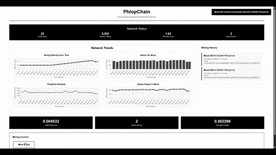
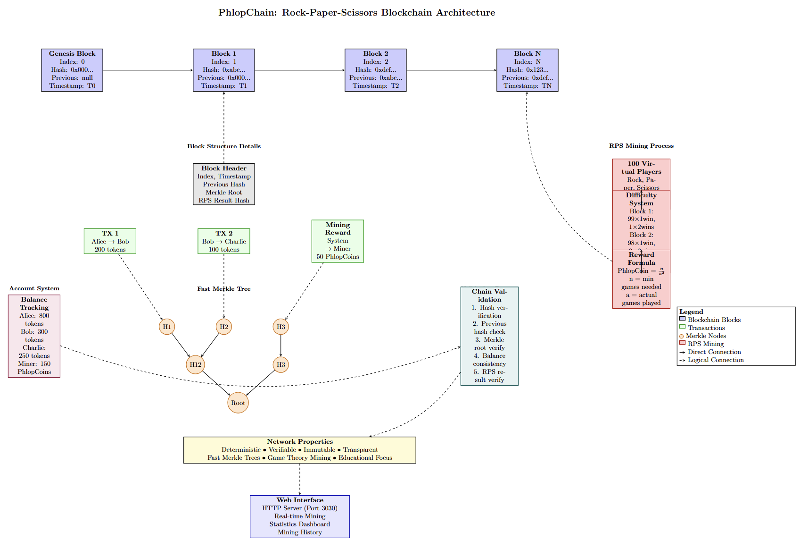

# PhlopChain: A Custom Rust Blockchain

A blockchain implementation that uses Rock-Paper-Scissors as its mining algorithm instead of traditional proof-of-work.




*Complete visual overview of PhlopChain's Rock-Paper-Scissors blockchain architecture, showing block structure, Merkle trees, mining process, and system components.*


## What is PhlopChain?

PhlopChain is a blockchain where miners compete by playing Rock-Paper-Scissors games against 100 virtual players. Instead of solving mathematical puzzles like Bitcoin, miners must win enough games to earn the right to create new blocks.

## How Mining Works

### Traditional Mining vs RPS Mining

**Traditional Blockchain Mining:**
- Miners solve computational puzzles
- First to solve gets to create the block
- Requires significant computational power

**PhlopChain RPS Mining:**
- Miners play Rock-Paper-Scissors against 100 virtual players
- Must achieve a required number of wins to mine a block
- Difficulty increases as more blocks are mined

### Mining Process

1. **Initial Setup**: 100 virtual players are created
2. **Round System**: Miners play multiple rounds against these players
3. **Win Requirements**: 
   - Block 1: 99 players need 1 win, 1 player needs 2 wins
   - Block 2: 98 players need 1 win, 2 players need 2 wins
   - Block 3: 97 players need 1 win, 3 players need 2 wins
   - And so on...

4. **Block Creation**: Once win requirements are met, the miner can create a new block

### Reward System

Miners earn PhlopCoin based on the formula: `n/a^2`

- `n` = minimum number of games needed (based on difficulty)
- `a` = actual number of games played

This rewards efficient miners who achieve the required wins quickly.


## Architecture Diagram



*Complete visual overview of PhlopChain's Rock-Paper-Scissors blockchain architecture, showing block structure, Merkle trees, mining process, and system components.*


## Technical Features

### Fast Merkle Trees

PhlopChain uses optimized Merkle trees for transaction verification:
- Efficient proof generation and verification
- Compact storage of transaction data
- Fast validation of block integrity

### Transaction System

- **Accounts**: Users have token balances tracked by the system
- **Validation**: Transactions are validated before being added to blocks
- **Mining Rewards**: Miners receive PhlopCoin for successfully mining blocks

### Web Interface

The blockchain includes a web interface where users can:
- Enter their name to start mining
- Mine blocks by playing RPS games
- View their mining history and earnings
- See real-time blockchain statistics

## Project Structure

```
rsm-en/
├── src/
│   ├── main.rs          # CLI demonstration
│   ├── web_main.rs      # Web server
│   ├── blockchain.rs    # Core blockchain logic
│   ├── rps_mining.rs    # Rock-Paper-Scissors mining
│   ├── merkle.rs        # Fast Merkle tree implementation
│   ├── transaction.rs   # Transaction and block structures
│   ├── balances.rs      # Account balance management
│   └── system.rs        # System utilities
├── static/
│   └── index.html       # Web interface
├── Cargo.toml           # Rust dependencies
└── Dockerfile           # Docker configuration
```

## Running the Application

### Local Development

1. **CLI Mode**: `cargo run`
2. **Web Server**: `cargo run --bin web_server`
3. **Access Web Interface**: Open `http://localhost:3030`

### Docker

1. **Build and Run**: `docker compose up`
2. **Access**: Open `http://localhost:3031`
3. **Alternative**: `docker run -p 3031:3030 phlopchain`

*Note: Docker uses port 3031 to avoid conflicts with local development.*

## How Blockchain Validation Works

1. **Block Hash Verification**: Each block's hash is validated
2. **Chain Integrity**: Previous block hashes are checked
3. **Transaction Validation**: All transactions are verified
4. **Balance Consistency**: Account balances are recalculated and verified
5. **Merkle Root Validation**: Transaction data integrity is confirmed

## Key Concepts

### Blockchain Basics

- **Block**: Container holding transactions and metadata
- **Chain**: Linked sequence of blocks using cryptographic hashes
- **Hash**: Unique fingerprint identifying each block
- **Merkle Root**: Single hash representing all transactions in a block

### Mining Economics

- **Difficulty**: How hard it is to mine a block (increases over time)
- **Reward**: PhlopCoin earned for successful mining
- **Efficiency**: Better performance (fewer games) yields higher rewards

### Network Properties

- **Deterministic**: Same inputs always produce same results
- **Verifiable**: Anyone can verify the blockchain's validity
- **Immutable**: Past blocks cannot be changed without invalidating the chain
- **Transparent**: All transactions and mining results are publicly visible

## Dependencies

- **Rust 1.81+**: Programming language
- **serde**: JSON serialization
- **sha2**: Cryptographic hashing
- **hex**: Hexadecimal encoding

## Development Notes

This is an educational blockchain implementation demonstrating:
- Alternative consensus mechanisms beyond proof-of-work
- Game theory applications in distributed systems
- Practical blockchain development in Rust
- Web interface integration with blockchain backends

The Rock-Paper-Scissors mining mechanism makes the blockchain accessible and understandable while maintaining core blockchain principles of decentralization, verification, and immutability.
